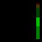
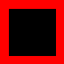
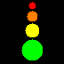
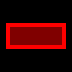

# Graphics
This module currently has the following methods to help draw graphics in an image buffer. Using `stackImage` it is also possible stack multiple of these image buffers to create more complext graphics, some of which are already made available as a [Presets](./presets.md)

[Bar](#bar)  
[Border](#border)  
[Corner](#corner)  
[Icon](#icon)  
[Rectangle](#rectangle)  
[StackImage](#stackimage)  
[ParseBase64](#parsebase64)  


---
## Bar
### Description
generates an imagebuffer of a bar representing a value from 0 to 100. The bar can be colored in different sections by providing multiple `colors`, where the total size equals 100. This for example allows for both simple progress bars to more complex volume meters with different colored sections for different dB levels.

  

### Required Options
| Param | Value |
| ----- | ----- |
| `width` | number |
| `height` | number |
| `colors` | [{ size: 0 - 100, color: number, background: number, backgroundOpacity: 0 - 255 }] |
| `barLength` | number |
| `barWidth` | number |
| `value` | 0 - 100 |
| `type` | 'vertical', 'horizontal' |

### Optional options
| Param | Value |
| ----- | ----- |
| `offsetX` | number |
| `offsetY` | number |
| `opacity` | 0 - 255 |

### Example
```javascript
const { graphics } = require('companion-module-utils')

...

micVolumeFeedback: {
  type: 'advanced',
  name: 'audio - Mic dB',
  description: 'Parses mic volume from logorithmic to a linear 0 to 100, and displays as a bar',
  options: [
    ...
  ],
  callback: (feedback) => {
    const options = {
      width: feedback.image.width,
      height: feedback.image.height,
      colors: [
        { size: 50, color: combineRgb(0, 255, 0), background: combineRgb(0, 255, 0), backgroundOpacity: 64 },
        { size: 25, color: combineRgb(255, 255, 0), background: combineRgb(255, 255, 0), backgroundOpacity: 64 },
        { size: 25, color: combineRgb(255, 0, 0), background: combineRgb(255, 0, 0), backgroundOpacity: 64 },
      ],
      barLength: 62.
      narWidth: 6,
      value: Math.pow(volume / 100, 0.25) * 100,
      type: 'vertical',
      offsetX: 64
      offsetY: 5,
      opacity: 255
    }

    return {
      imageBuffer: graphics.bar(options)
    }
  }
}
```

---
## Border
### Description
Generates a border around the outter edge of the image, defaulting to all sides but can be limit to a specifc side.

 

### Required Options
| Param | Value |
| ----- | ----- |
| `width` | number |
| `height` | number |
| `color` | number |
| `size` | number |

### Optional options
| Param | Value |
| ----- | ----- |
| `opacity` | 0 - 255 |
| `type` | 'border', 'top', 'bottom', 'left', 'right' |

### Example
```javascript
const { graphics } = require('companion-module-utils')

...

exampleBorderFeedback: {
  type: 'advanced',
  name: 'Border example',
  description: 'Checks a value, and if true returns a border around the edge of the button',
  options: [
    ...
  ],
  callback: (feedback) => {
    if (booleanVariable) {
      const options = {
        width: feedback.image.width,
        height: feedback.image.height,
        color: combineRgb(255, 0, 0),
        size: 5.
        opacity: 255,
        type: 'border'
      }

      return {
        imageBuffer: graphics.border(options)
      }
    }
  }
}
```

---
## Circle
### Description
Generates an image buffer of a circle at a specified radius. Width and Height are 2 x radius



### Required Options
| Param | Value |
| ----- | ----- |
| `radius` | number |
| `color` | number |

### Optional options
| Param | Value |
| ----- | ----- |
| `opacity` | 0 - 255 |

### Exmaple
```javascript
const { graphics } = require('companion-module-utilz')

...

exampleBorderFeedback: {
  type: 'advanced',
  name: 'Border example',
  description: 'Checks a value, and if true returns a border around the edge of the button',
  options: [
    ...
  ],
  callback: (feedback) => {
    if (booleanVariable) {
      const options = {
        radius: 8,
        color: combineRgb(255, 0, 0),
        opacity: 255
      }

      const circle = graphics.circle(options)

      const circleIcon = graphics.icon({
          width: feedback.image.width,
          height: feedback.image.height,
          custom: circle1
          type: 'custom',
          customHeight: 16,
          customWidth: 16,
          offsetX: 28,
          offsetY: 28
        })

      return {
        imageBuffer: circleIcon
      }
    }
  }
}
```

---
## Corner
### Description
Generates an indicator in the corner of the image

 

### Required Options
| Param | Value |
| ----- | ----- |
| `width` | number |
| `height` | number |
| `color` | number |
| `size` | number |
| `location` | 'topLeft', 'topRight', 'bottomLeft', 'bottomRight' |

### Optional options
| Param | Value |
| ----- | ----- |
| `opacity` | 0 - 255 |

### Example
```javascript
const { graphics } = require('companion-module-utils')

...

exampleCornerFeedback: {
  type: 'advanced',
  name: 'Corner example',
  description: 'Checks a value, and if true returns a Corner in the Top Left of the button',
  options: [
    ...
  ],
  callback: (feedback) => {
    if (booleanVariable) {
      const options = {
        width: feedback.image.width,
        height: feedback.image.height,
        color: combineRgb(255, 0, 0),
        size: 5.
        location: 'topLeft',
        opacity: 255
      }

      return {
        imageBuffer: graphics.corner(options)
      }
    }
  }
}
```

---
## Icon
### Description
Generates an imagebuffer with a predefined icon.
The mic icons are 22x30, and the headset icons are 30x30.

### Icons

  
*text is not part of the icon*

### Required Options
| Param | Value |
| ----- | ----- |
| `width` | number |
| `height` | number |
| `type` | 'mic1', 'mic2', 'mic3', 'mic4', 'mic5', 'headset1', 'headset2', 'headset3', 'headset4' |

### Optional options
| Param | Value |
| ----- | ----- |
| `offsetX` | number |
| `offsetY` | number |


### Example
```javascript
const { graphics } = require('companion-module-utils')

...

micStateFeedback: {
  type: 'advanced',
  name: 'audio - Mic State',
  description: 'Indicates if a mic is muted, active, or idle',
  options: [
    ...
  ],
  callback: (feedback) => {
    const options = {
      width: feedback.image.width,
      height: feedback.image.height,
      offsetX: 25,
      offsetY: 10
    }

    if (mic.muted) {
      options.type === 'mic3'
    } else if (mic.active) {
      options.type === 'mic5'
    } else {
      options.type === 'mic1'
    }

    return {
      imageBuffer: graphics.icon(options)
    }
  }
}
```

---
## Rectangle
### Description

 

### Required Options
| Param | Value |
| ----- | ----- |
| `width` | number |
| `height` | number |
| `color` | number |
| `rectWidth` | number |
| `rectHeight` | number |
| `strokeWidth` | number |

### Optional options
| Param | Value |
| ----- | ----- |
| `opacity` | 0 - 255 |
| `fillColor` | number |
| `fillOpacity` | 0 - 255 |
| `offsetX` | number |
| `offsetY` | number |

### Example
```javascript
const { graphics } = require('companion-module-utils')

...

exampleRectFeedback: {
  type: 'advanced',
  name: 'Rectangle example',
  description: 'Checks a value, and if true returns a Rectangle in the center of the button',
  options: [
    ...
  ],
  callback: (feedback) => {
    if (booleanVariable) {
      const options = {
        width: feedback.image.width,
        height: feedback.image.height,
        color: combineRgb(255, 0, 0),
        rectWidth: 60,
        rectHeight: 26,
        strokeWidth: 4,
        opacity: 255
        fillColor: combineRgb(255, 0, 0),
        fillOpacity: 128,
        offsetX: 6,
        offsetY: 23,
      }

      return {
        imageBuffer: graphics.rect(options)
      }
    }
  }
}
```

---
## StackImage
### Description
Stacks multiple image buffers of the same resolution into a single image buffer

### Required Arguments
An array of image buffers

### Example
```javascript
const { graphics } = require('companion-module-utils')

...

audioStateFeedback: {
  type: 'advanced',
  name: 'audio - Mic and Headset State',
  options: [
    ...
  ],
  callback: (feedback) => {
    const optionsMic = {
      width: feedback.image.width,
      height: feedback.image.height,
      offsetX: 13,
      offsetY: 10,
      type: 'mic1'
    }

    const optionsHeadset = {
      width: feedback.image.width,
      height: feedback.image.height,
      offsetX: 33,
      offsetY: 10,
      type: 'headset1'
    }

    const micIcon = graphics.icon(optionsMic)
    const headsetIcon = graphics.icon(optionsHeadset)


    return {
      imageBuffer: graphics.stackImage([micIcon, headsetIcon])
    }
  }
}

```

---
## ParseBase64
### Description
Takes a base64 encoded PNG and generates an image buffer. If the PNG is equal to the resolution of the button then the image buffer can be used directly in feedback, otherwise it should be used in conjuction with the `icon` function to place that image buffer within the correct resolution.

### Required Arguments
A base64 string

## Optional Arguments
| Param | Value |
| ----- | ----- |
| `alpha` | true / false (default true) |

### Example

```javascript
const { graphics } = require('companion-module-utils')

...

fullSizePNG: {
  type: 'advanced',
  name: 'Parse a Base64 PNG and render directly to a button',
  options: [
    ...
  ],
  callback: async (feedback) => {
    const png64 = '...'
    const imageBuffer = await graphics.parseBase64(png64, { alpha: true })

    return {
      imageBuffer: imageBuffer
    }
  }
},

smallPNG: {
  type: 'advanced',
  name: 'Parse a Base64 PNG, position it using icon, then render to a button',
  options: [
    ...
  ],
  callback: async (feedback) => {
    const png64 = '...'
    const icon = await graphics.parseBase64(png64, { alpha: true })

    const imageBuffer = graphics.icon({
      width: feedback.image.width,
      height: feedback.image.height,
      offsetX: 20,
      offsetY: 20,
      type: 'custom',
      custom: icon,
      customWidth: 40,
      customHeight: 40
    })

    return {
      imageBuffer: imageBuffer
    }
  }
},


```