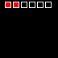
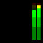

# Presets
Presets are a quick and easy way to utilize multiple stacked graphics that have some settings pre-configured, allowing for ease of use within a Companion module.

---
## Boxes
### Description
Displays a series of boxes, up to 6, along one edge of the button. Each box can be individually colored for whatever the needs of a module may require.

  

### Required Options
| Param | Value |
| ----- | ----- |
| width | number |
| height | number |
| position | 'top', 'bottom', 'left', 'right' |
| boxes | [{ borderColor: number, borderOpacity: 0 - 255, fillColor: number, fillOpacity: 0 - 255 }] |


### Example
```javascript
const { presets } = require('companion-module-utils')

...

boxesFeedback: {
  type: 'advanced',
  name: 'Boxes Example',
  description: 'Creates 6 boxes, the first 2 being filled, aligned to the top of the button',
  options: [
    ...
  ],
  callback: (feedback) => {
    const boxes = presets.boxes({
      width: feedback.image.width,
      height: feedback.image.height,
      position: 'top',
      boxes: [
        { borderColor: combineRgb(255, 255, 255), borderOpacity: 255, fillColor: combineRgb(255, 0, 0), fillOpacity: 255 },
        { borderColor: combineRgb(255, 255, 255), borderOpacity: 255, fillColor: combineRgb(255, 0, 0), fillOpacity: 255 },
        { borderColor: combineRgb(255, 255, 255), borderOpacity: 255, fillColor: combineRgb(255, 0, 0), fillOpacity: 0 },
        { borderColor: combineRgb(255, 255, 255), borderOpacity: 255, fillColor: combineRgb(255, 0, 0), fillOpacity: 0 },
        { borderColor: combineRgb(255, 255, 255), borderOpacity: 255, fillColor: combineRgb(255, 0, 0), fillOpacity: 0 },
        { borderColor: combineRgb(255, 255, 255), borderOpacity: 255, fillColor: combineRgb(255, 0, 0), fillOpacity: 0 },
      ]
    })

    return {
      imageBuffer: boxes
    }
  }
}
```

---
## Meter Style 1
### Description
Style 1 of a volume meter, supporting either 1 or 2 channels, colors styled on vMix's meters. If muted it set to true it will display alternate coloring to indicate audio on the channel that is not live.

  

### Required Options
| Param | Value |
| ----- | ----- |
| width | number |
| height | number |
| meter1 | 0 - 100 |

### Optional options
| Param | Value |
| ----- | ----- |
| meter2 | 0 - 100 |
| muted | boolean |

### Example
```javascript
const { graphics } = require('companion-module-utils')

...

micVolumeFeedback: {
  type: 'advanced',
  name: 'audio - Volume Meter',
  description: 'Parses mic volume from logorithmic to a linear 0 to 100, and displays as a bar',
  options: [
    ...
  ],
  callback: (feedback) => {
    const meter = presets.meter1({
      width: feedback.image.width,
      height: feedback.image.height,
      meter1: Math.pow(meter1 / 100, 0.25) * 100,
      meter2: Math.pow(meter2 / 100, 0.25) * 100,
      muted: bus.muted
    })

    return {
      imageBuffer: meter
    }
  }
}
```